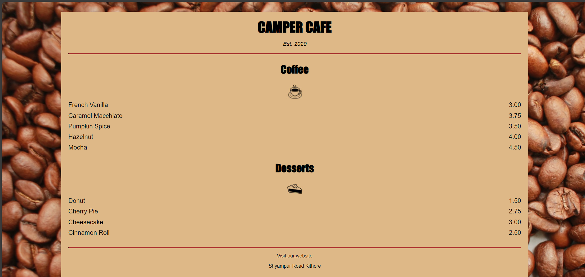

# Camper Cafe Menu

This is a simple **Cafe Menu** webpage designed for **Camper Cafe**. The menu showcases a variety of coffee and dessert options along with their prices. The webpage is built using **HTML** and styled with **CSS**.

---

## Features

- **Cafe Name and Establishment Date**: Displays the cafe name (`Camper Cafe`) and the year it was established (`Est. 2020`).
- **Coffee Menu**: Lists various coffee flavors with their prices.
- **Dessert Menu**: Lists various desserts with their prices.
- **Icons**: Includes icons for coffee and desserts.
- **Footer**: Contains a link to the cafe's website and the cafe's address.

---

## Technologies Used

- **HTML**: For structuring the webpage.
- **CSS**: For styling the webpage (e.g., fonts, colors, layout).

---

## Project Structure

The project consists of the following files:

1. **`index.html`**:
   - The main HTML file that contains the structure of the cafe menu.
   - Includes sections for coffee and desserts, along with their prices.

2. **`style.css`**:
   - The CSS file that styles the HTML elements (e.g., fonts, colors, layout).

3. **Images**:
   - `coffee.jpg`: Icon for the coffee section.
   - `pie.jpg`: Icon for the dessert section.

---

## How to Run the Project

1. **Download the Project**:
   - Clone or download the repository to your local machine.

2. **Open the Project**:
   - Navigate to the project folder and open `index.html` in your web browser.

3. **View the Menu**:
   - The cafe menu will be displayed in the browser.

---

## Screenshots

---

## Acknowledgments

- **FreeCodeCamp**: For inspiring the design of this cafe menu.

---

## Contact

For any questions or feedback, feel free to reach out:

- **Email**: zeeshansartaj.cs@gmail.com
